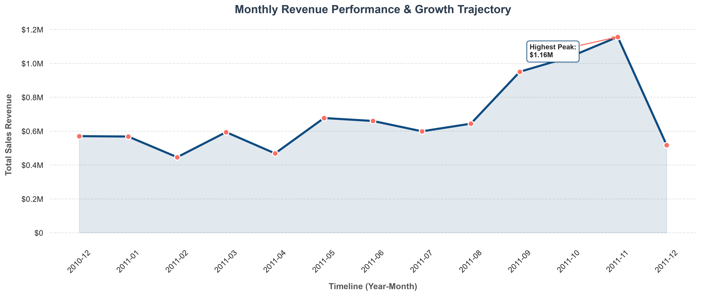
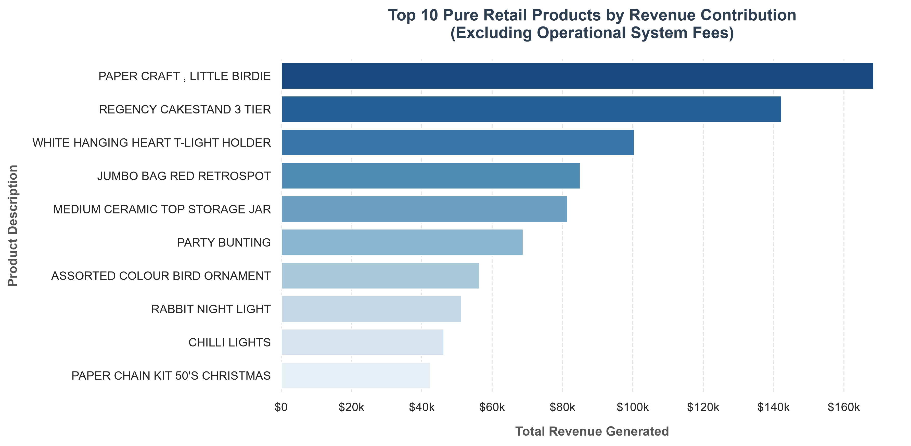

# 📊 E-Commerce Global Revenue Data Pipeline

[](https://www.python.org/)
[](https://github.com/engineeraliarfa/ECommerce-Global-Revenue-Pipeline)
[](https://github.com/engineeraliarfa/ECommerce-Global-Revenue-Pipeline)
[](https://github.com/engineeraliarfa/ECommerce-Global-Revenue-Pipeline)

## 🚀 Project Overview
This project is an end-to-end data pipeline designed to clean, transform, and analyze global e-commerce sales records. The goal is to turn raw, messy transactional data into clean business insights, showing where the revenue comes from and how sales change over time.

## 🏗️ Pipeline Architecture
1. **Data Ingestion:** Loading raw CSV files into the workspace.
2. **Data Cleaning:** Removing missing values and filtering out non-order entries (like `POSTAGE` and `MANUAL`).
3. **Feature Engineering:** Creating time-based features (Hour, Day, Month) to track when customers spend the most.
4. **Data Visualization:** Saving clear plots to help stakeholders understand market trends.

## 📁 Repository Structure
```text
📁 ECommerce-Global-Revenue-Pipeline/
│
├── 📁 data/                           # Raw and cleaned datasets
├── 📁 plots/                          # Generated graphical assets
│   ├── 📊 interactive_monthly_revenue.html  # Interactive Plotly Dashboard
│   ├── 📈 monthly_revenue_trend.png        # Monthly performance charts
│   ├── ⏰ hourly_transaction_volume.png    # Transaction count per hour
│   ├── 📅 weekly_sales_distribution.png    # Weekly revenue spread
│   └── 🏆 top_10_revenue_products.png     # Highest selling items
├── 📄 ECommerce_Analysis.ipynb        # Main Jupyter Notebook with core code
└── 📄 README.md                       # Project documentation
```

## 🛠️ Tech Stack & Requirements
* **Language:** Python 3.11+
* **Libraries Used:** `pandas`, `numpy`, `matplotlib`, `seaborn`, `plotly`

To setup the environment, install the dependencies using:
```bash
pip install pandas numpy matplotlib seaborn plotly
```

## 📈 Key Insights & Visualizations Showcase
The pipeline uncovered critical operational trends from the dataset, mapped directly to the generated plots:

### 1. Q4 Seasonal Domination & Revenue Growth
The temporal analysis proved a massive, multi-million dollar revenue escalation during **late Q3 and Q4 (September to November)**. This trajectory highlights that corporate liquidity relies heavily on seasonal holiday procurement.


### 2. Commercial Inventory Vitality (Top Performers)
After scrubbing non-retail system artifacts (such as system adjustments), specific core revenue anchors were isolated. Products like *"Paper Craft, Little Birdie"* and *"Regency Cakestand 3 Tier"* dictate the highest share of product-driven cash flow.


### 3. Interactive Dynamic Analysis Dashboard
The pipeline generates a standalone interactive asset allowing stakeholders to zoom, hover, and filter comprehensive revenue trends dynamically without writing a single line of code.
* **Live Local Server Link:** [Launch Interactive Dashboard](http://127.0.0.1:3000/plots/interactive_monthly_revenue.html) *(Ensure your local server is running on port 3000)*

## 🚀 How to Run the Project
1. Clone the repository:
   ```bash
   git clone [https://github.com/engineeraliarfa/ECommerce-Global-Revenue-Pipeline.git](https://github.com/engineeraliarfa/ECommerce-Global-Revenue-Pipeline.git)
   ```
2. Open the project folder:
   ```bash
   cd ECommerce-Global-Revenue-Pipeline
   ```
3. Run the notebook to see the pipeline in action:
   ```bash
   jupyter notebook ECommerce_Analysis.ipynb
   ```

## 👤 Developer Profile
* **Name:** Muhammad Ali Arfa
* **Focus:** AI & Data Engineering Student
* **Project Link:** [GitHub Repository](https://github.com/engineeraliarfa/ECommerce-Global-Revenue-Pipeline)